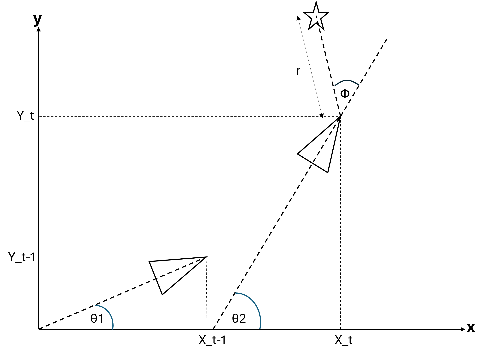
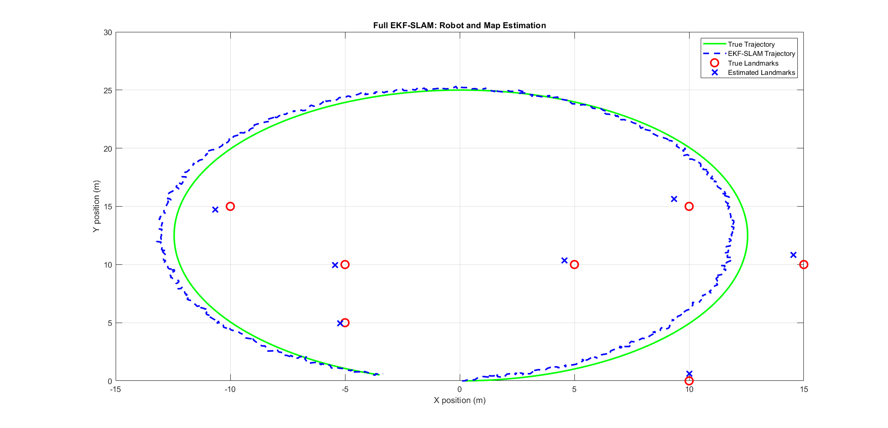
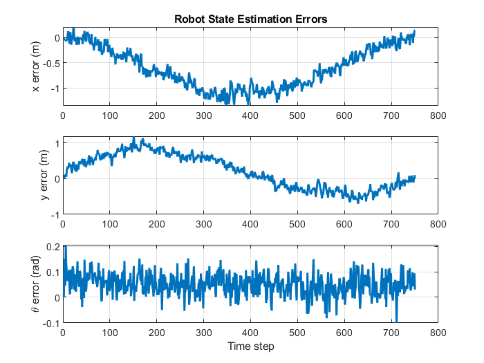
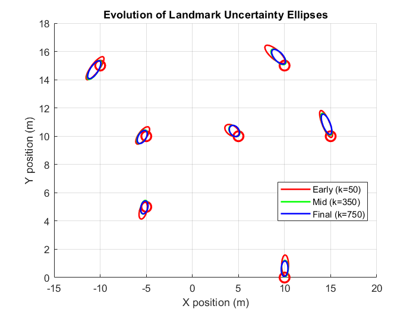

# EKF-SLAM for Mobile Robot Localization (Mini-Project)

This repository contains a MATLAB implementation of **Simultaneous Localization and Mapping (SLAM)** using an **Extended Kalman Filter (EKF)**. The project estimates a mobile robot's pose while constructing a map of seven static landmarks in a 2D environment.

## 📌 Project Overview

The simulation models a robot moving in a circular trajectory with a constant linear velocity  m/s and angular velocity  rad/s. The system uses range-bearing sensor measurements to detect landmarks and correct the robot's pose estimation.

### Key Features

* **Augmented State Vector**: Jointly tracks the robot pose  and the Cartesian coordinates of  landmarks.


* **Nonlinear Modeling**: Implements first-order Taylor expansion (Jacobian matrices  and ) to linearize the motion and measurement models.


* **Uncertainty Visualization**: Generates 95% confidence covariance ellipses that visibly "shrink" as landmarks are repeatedly observed.


* **Robust Correction**: Uses `atan2(sin, cos)` for bearing normalization to prevent angular drift during the update phase.


---

## 🛠 Methodology

The EKF follows a recursive process as described in the course modules:

<p align="center">

</p>

<i><b>Figure:</b> Robot schematic used in this project (Picture4.png)</i>

1. **Prediction**: Propagates the previous state estimate using a discrete-time Euler integration model.


2. **Correction**: Updates the predicted state and covariance matrix using the Kalman Gain and sensor innovations.


3. **Landmark Initialization**: New landmarks are added to the state vector upon their first observation using the current robot pose.


---

## 📊 Results

The filter maintains high stability and accuracy over the **750-step** simulation:

> Note: The figures shown below are image files included in this repository (1.png, 2.png, 3.png).

<p align="center">



<i><b>Figure 1:</b> Full EKF-SLAM Robot and Map Estimation </i>
</p>

* **Trajectory**: The estimated path (blue dashed line) stays closely aligned with the ground truth (green solid line).


* **Errors**: Pose estimation errors remain bounded within ** m** for position and ** rad** for heading.


<p align="center">



<i><b>Figure 2:</b> Robot State Estimation Errors over 750 steps </i>
</p>

* **Consistency**: True landmarks consistently remain within the 95% confidence ellipses, proving statistical accuracy.


<p align="center">



<i><b>Figure 3:</b> Evolution of Landmark Uncertainty Ellipses </i>
</p>


---

## 🚀 Getting Started

1. Ensure you have **MATLAB** installed.
2. Clone the repository:
```bash
git clone https://github.com/Pasindu-Nimsara-2002/Extended-Kalman-Filter-for-Mobile-Robot-Localization---Mini-Project.git

```


3. Run the main simulation script `ekf_slam_v02.m` to generate the trajectory and error analysis plots.


---

## 📚 References

This project was developed for the **EN4594 Autonomous Systems** module at the University of Moratuwa.


* **Author**: Kulasingham P.N. (210303U) .


---
